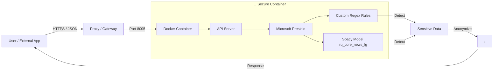

# 🇷🇺 mcp-152fz-anonymizer (Data Anonymization)


> **Мощный инструмент для автоматического обезличивания персональных данных (ПД) в соответствии с 152-ФЗ.**
> Работает локально и в Docker. Идеально для интеграции с n8n, Zapier и LLM-агентами.

---

<details>
<summary><strong>🇬🇧 English Description (Click to expand)</strong></summary>

### 152-FZ Data Anonymizer (GDPR-like for Russia)

This service automatically detects and masks sensitive personal data in text, compliant with Russian Law 152-FZ. It uses specific regex patterns for Russian documents (Passports, SNILS, INN) and ML models (Spacy) for Named Entity Recognition.

**Key Features:**

- **25+ Entity Types**: Russian Passports, Driver Licenses, Bank Cards, Names, Addresses, etc.
- **Dual Mode**: Works as an MCP Server (Model Context Protocol) for LLM agents or as a standalone HTTP API (FastAPI) for webhooks.
- **Privacy First**: Can be deployed on your own VPS/Hardware. No data leaves your perimeter.
- **Docker Ready**: Simple deployment via `docker-compose`.

</details>

---

## 🏗 Архитектура



## ✨ Возможности

Сервис распознает и заменяет более **25 категорий** данных:

| Категория                        | Примеры                                    | Замена (Placeholder)                        |
| :------------------------------- | :----------------------------------------- | :------------------------------------------ |
| **🗳 Государственные документы** | Паспорт РФ, Загран, СНИЛС, ИНН, ОМС, Права | `<PASSPORT_RF>`, `<SNILS>`, `<INN>`         |
| **👤 Личность и Контакты**       | ФИО, Телефоны, Email, Telegram ID          | `<PERSON>`, `<PHONE>`, `<EMAIL>`            |
| **💳 Финансы**                   | Номера карт, IBAN, Крипто-кошельки         | `<BANK_CARD>`, `<BANK_ACCOUNT>`, `<WALLET>` |
| **💻 Цифровой след**             | IP адреса, MAC, IMEI                       | `<IP>`, `<MAC>`, `<IMEI>`                   |
| **📍 Гео и Время**               | Адреса, Координаты (GPS), Даты             | `<LOC>`, `<GEO>`, `<DATE>`                  |

## 🚀 Быстрый старт (Docker API)

Рекомендуемый способ для продакшна и интеграций (n8n, сайты).

### 1. Клонирование и настройка

```bash
git clone https://github.com/Pioneer113-new/mcp-152fz-anonymizer.git
cd mcp-152fz-anonymizer
```

Создайте файл с API ключами (обязательно для защиты):

```bash
cp api_keys.example.json api_keys.json
# Отредактируйте api_keys.json, вставив свой надежный ключ
```

### 2. Запуск контейнера

```bash
docker-compose up --build -d
```

Сервер запустится на порту **8005** (проверьте настройки Firewall!).

### 3. Пример использования (CURL)

```bash
curl -X POST "http://localhost:8005/anonymize" \
     -H "Content-Type: application/json" \
     -H "X-API-Key: ВАШ_КЛЮЧ" \
     -d '{ "text": "Меня зовут Иван, паспорт 4500 123456" }'
```

**Ответ:**

```json
{
  "anonymized_text": "Меня зовут <PERSON>, паспорт <PASSPORT_RF>"
}
```

## 🛠 Локальная разработка (MCP Mode)

Используйте этот режим для подключения к Claude Desktop, Cursor или разработки новых правил.

1.  **Установка зависимостей:**
    ```bash
    ./install.sh
    ```
2.  **Активация окружения:**
    ```bash
    source venv/bin/activate
    ```
3.  **Запуск MCP сервера:**
    ```bash
    mcp run main.py
    ```

## 🛡 Безопасность

- **Изоляция**: Работает в Docker от непривилегированного пользователя (`uid:1000`).
- **ReadOnly**: Файловая система контейнера защищена от записи.
- **Auth**: Доступ к API только по ключам (`X-API-Key`).
- **No Logs**: Сервис не сохраняет обрабатываемые данные (stateless).

## 🤝 Contributing

Вклад в развитие проекта приветствуется! Пожалуйста, ознакомьтесь с [CONTRIBUTING.md](CONTRIBUTING.md) перед созданием Pull Request.

## 📄 Лицензия

Этот проект распространяется под лицензией MIT. Подробности в файле [LICENSE](LICENSE).
